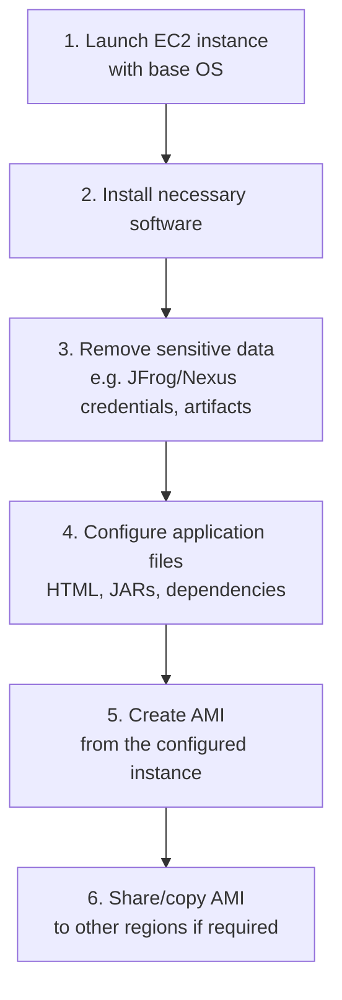

## Topic: AMI (Amazon Machine Image)

## 1. What is an AMI?

An **AMI (Amazon Machine Image)** is a pre-configured template used to launch EC2 instances. Instead of manually installing an OS and software every time, you "snapshot" a fully-set-up server once and reuse it to launch identical instances instantly.

Think of an AMI like a **cake mold** — once you've shaped one perfect cake, you can pour the same mix into the mold again and again and get identical cakes every time, instead of baking from scratch each time.

## 2. What's Inside an AMI?

| Component | Examples |
|---|---|
| **Operating System** | Ubuntu, RedHat, Amazon Linux, macOS, Windows |
| **Pre-installed software** | Java, Nginx, Apache, etc. |
| **Configuration files** | HTML files, config files, JAR files |

## 3. AMIs and Regions

- An AMI is created in **one region** and gets a **unique ID** specific to that region.
- The same AMI can be **copied to another region**, but the copy gets its **own new unique ID** in the destination region.

> 💡 **Key point:** An AMI ID is never portable across regions as-is — you must explicitly copy it, and AWS assigns a fresh ID to the copy.

## 4. Building an AMI — Step by Step



| Step | Action | Why It Matters |
|---|---|---|
| 1 | Launch an EC2 instance with a base OS | Starting point — a clean, known-good OS |
| 2 | Install necessary software | Bakes required packages into the image so future launches don't need to reinstall |
| 3 | Remove sensitive data (credentials, build artifacts) | Prevents secrets from being baked into a shareable image — a common security mistake |
| 4 | Configure application files (HTML, JARs, dependencies) | Makes the instance "ready to serve" out of the box |
| 5 | Create the AMI | Freezes this exact state into a reusable template |
| 6 | Share/copy AMI to other regions | Enables launching identical instances in other regions (gets a new unique ID there) |

## 5. Worked Example — Deploying the Zay Website

This demonstrates steps 2–4 of the AMI process: installing software and configuring application files before turning the instance into an AMI.

**Template used:** [Zay Shop Template](https://templatemo.com/tm-559-zay-shop#google_vignette) ([download link](https://templatemo.com/download/templatemo_559_zay_shop))

```sh
sudo apt-get update && \
sudo apt-get install nginx unzip -y && \
cd /tmp/ && \
wget https://templatemo.com/tm-zip-files-2020/templatemo_559_zay_shop.zip && \
unzip templatemo_559_zay_shop.zip && \
cd templatemo_559_zay_shop && \
sudo cp -rf . /var/www/html/ && \
sudo apt install stress -y
```

**What this does:**
1. Updates package lists and installs **nginx** (web server) and **unzip**
2. Downloads and unzips the Zay website template into `/tmp/`
3. Copies the site files into `/var/www/html/` — nginx's default web root
4. Installs **stress** (a load-testing utility, often used later for demos/testing)

Once done, the site is reachable at:

```
http://<ipaddress>
```


> 💡 At this point, this exact instance state (nginx + site files) is a perfect candidate to freeze into an AMI — so any future instance launched from it serves the same website immediately.

## 6. Tools for Building AMIs at Scale

Manually clicking through the console works for one-off AMIs, but doesn't scale. Two common automation tools:

| Tool | Approach |
|---|---|
| **Packer** | Infrastructure-as-code tool (HashiCorp) — define a build template, and it automates launching an instance, provisioning it, and creating the AMI |
| **EC2 Image Builder** | AWS-native pipeline service — define a **pipeline** that launches an **instance**, installs software via **user_data** (often using the **AWS SSM agent**), and outputs a finished AMI automatically |
